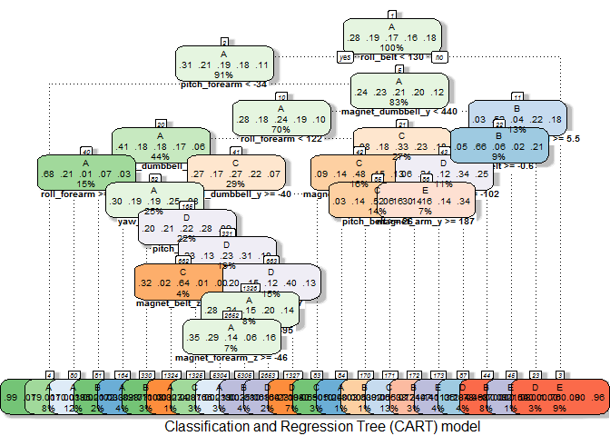

# Practical Machine Learning Project

<BR>

## Loading and preprocessing the data

Firstly, the files with the project data have been downloaded and two dataframes **test** and **training** are loaded from them.


```r
# Loading the data
training <- read.csv("./data/pml-training.csv")
testing  <- read.csv("./data/pml-testing.csv")
```

The goal is to predict the "classe" variable in the testing set. Let's see which values are possible.


```r
# Structure and summary statistics of "classe"
str(training$classe)
```

```
##  Factor w/ 5 levels "A","B","C","D",..: 1 1 1 1 1 1 1 1 1 1 ...
```

```r
summary(training$classe)
```

```
##    A    B    C    D    E 
## 5580 3797 3422 3216 3607
```


The "classe" variable is a factor with 5 levels: A, B, C, D and E. According to the documentation, A corresponds to the specified execution of the weight lifting exercise, while the other 4 values correspond to common mistakes.

There are 19622 observations of 160 variables in the training set as opposed to 20 observations of the same variables in the test set. Looking at the loaded data, we can see that the not available values are not denoted with the same value Some variables include values "NA", as avg_roll_belt, others the empty string "", as kurtosis_roll_belt, and others the value "#DIV/0!", as kurtosis_yaw_belt. With the aim of unifiying that values, let's reload the data and fix this:  


```r
# Loading the data again preprocessing NA's for consistence in their representation
training <- read.csv("./data/pml-training.csv", na.strings = c("NA", "", "#DIV/0!"))
testing  <- read.csv("./data/pml-testing.csv", na.strings = c("NA", "", "#DIV/0!"))
```

As result of this preprocessing, not only the null values are brought together, but the type of some variables previously casted as factor, are now refined to be numerical or logical, improving the parsing performed by the read.csv function. 


We can exclude the first seven variables (X, user_name, raw_timestamp_part_1, raw_timestamp_part_2, cvtd_timestamp, new_window, num_window) containing some metadata of the experiment as the number of row, user name, timestamp or window, but nothing useful to determine the quality of the exercise. On the other hand, we can clean the data by excluding variables with NA's and variables that have near zero variance, because they are not suitable to be proper predictors. 


```r
# Exclusion of the first seven variables with metadata unrelated to the outcome
training <- training [ , -(1:7)]
             
# Exclusion of variables without values
checkWithoutNAs <- sapply(training, function(x)all(!is.na(x)))
variablesWithoutNAs <- names(checkWithoutNAs)[names(checkWithoutNAs) 
                       %in% names(checkWithoutNAs)[checkWithoutNAs]]
training <- training[ , variablesWithoutNAs]

# Exclusion of variables with near zero variance, if any 
library(caret)
variablesWithNearZeroVar <- nearZeroVar(training)
if (length(variablesWithNearZeroVar) > 0)
        training <- training[ , -variablesWithNearZeroVar]
```

## Splitting the data

Since the test set will serve for a separate prediction task, let's build for our model evaluations two different training and test sets coming from the original training set, containing 3/4 and 1/4 of the data, respectively. The vector of outcomes for the partition will be the variable "classe" that will be predicted later.


```r
# Splitting training and test set for model evaluations
inTrain  <- createDataPartition(training$classe, p = 3/4, list = FALSE)
trainData <- training[ inTrain, ]
testData  <- training[ -inTrain, ]
```

## Prediction models and cross validation


A Generalized Linear Model is not appropriate for predicting this variable, since GLM models can only use 2-class outcomes, while we need to deal with five available outcomes: A, B, C, D and E. 

We will consider three aproaches: decision trees, linear discriminant analysis and random forest, choosing the one with the best accuracy. A random seed is set to enable the results to be reproducible. 

### CART model

Let's fit a Classification and Regression Tree (CART) model with the rpart method using all the remaining predictor variables.


```r
set.seed(201601)
library(rpart)
modelCART <- rpart(classe ~ ., data = trainData, method = "class")
library(rattle)
fancyRpartPlot(modelCART, sub = "Classification and Regression Tree (CART) model", 
               cex = 0.6)
```



Let's predict the variable in the test set and evaluate the model by its confusion matrix:


```r
# Prediction and confusion matrix
predictionCART <- predict(modelCART, testData, type = "class")
confusionMatrix(predictionCART, testData$classe)
```

```
## Confusion Matrix and Statistics
## 
##           Reference
## Prediction    A    B    C    D    E
##          A 1211  147   10   28   26
##          B   59  636  129   95  122
##          C   37   67  639  110  101
##          D   52   66   53  530   66
##          E   36   33   24   41  586
## 
## Overall Statistics
##                                           
##                Accuracy : 0.7345          
##                  95% CI : (0.7219, 0.7468)
##     No Information Rate : 0.2845          
##     P-Value [Acc > NIR] : < 2.2e-16       
##                                           
##                   Kappa : 0.6639          
##  Mcnemar's Test P-Value : < 2.2e-16       
## 
## Statistics by Class:
## 
##                      Class: A Class: B Class: C Class: D Class: E
## Sensitivity            0.8681   0.6702   0.7474   0.6592   0.6504
## Specificity            0.9399   0.8976   0.9222   0.9422   0.9665
## Pos Pred Value         0.8516   0.6110   0.6698   0.6910   0.8139
## Neg Pred Value         0.9472   0.9190   0.9453   0.9338   0.9247
## Prevalence             0.2845   0.1935   0.1743   0.1639   0.1837
## Detection Rate         0.2469   0.1297   0.1303   0.1081   0.1195
## Detection Prevalence   0.2900   0.2123   0.1945   0.1564   0.1468
## Balanced Accuracy      0.9040   0.7839   0.8348   0.8007   0.8085
```

As shown in the confusion matrix, the CART accuracity is about 73.5%, and it is not enough for our assignment because the later quiz will require at last 80% of success in predictions. 


### Linear discriminant analysis


```r
set.seed(201601)
library(MASS)
modelLDA <- lda(classe ~ ., data = trainData)
predictionLDA <- predict(modelLDA, testData, type = "class")
confusionMatrix(predictionLDA$class, testData$classe)
```

```
## Confusion Matrix and Statistics
## 
##           Reference
## Prediction    A    B    C    D    E
##          A 1154  148   77   42   36
##          B   30  604   82   36  141
##          C  115  108  564   74   91
##          D   89   38  103  625   88
##          E    7   51   29   27  545
## 
## Overall Statistics
##                                           
##                Accuracy : 0.7121          
##                  95% CI : (0.6992, 0.7247)
##     No Information Rate : 0.2845          
##     P-Value [Acc > NIR] : < 2.2e-16       
##                                           
##                   Kappa : 0.6356          
##  Mcnemar's Test P-Value : < 2.2e-16       
## 
## Statistics by Class:
## 
##                      Class: A Class: B Class: C Class: D Class: E
## Sensitivity            0.8272   0.6365   0.6596   0.7774   0.6049
## Specificity            0.9137   0.9269   0.9042   0.9224   0.9715
## Pos Pred Value         0.7920   0.6764   0.5924   0.6628   0.8270
## Neg Pred Value         0.9301   0.9140   0.9264   0.9548   0.9161
## Prevalence             0.2845   0.1935   0.1743   0.1639   0.1837
## Detection Rate         0.2353   0.1232   0.1150   0.1274   0.1111
## Detection Prevalence   0.2971   0.1821   0.1941   0.1923   0.1344
## Balanced Accuracy      0.8704   0.7817   0.7819   0.8499   0.7882
```

```r
# The same result was obtained through caret package training with lda
# modelLDA <- train(classe ~ ., data = trainData, method = "lda")
# predictionLDA <- predict(modelLDA, testData)
# confusionMatrix(predictionLDA, testData$classe)
```

The LDA accuracity is about 70%, even worse than the CART accuracity. We need to evaluate other kind of model for a better fit. 

### Random Forest


```r
set.seed(201601)
library(randomForest)
modelRF <- randomForest(classe ~ ., data = trainData, importance = FALSE)
predictionRF <- predict(modelRF, testData)
confusionMatrix(predictionRF, testData$classe)
```

```
## Confusion Matrix and Statistics
## 
##           Reference
## Prediction    A    B    C    D    E
##          A 1395    4    0    0    0
##          B    0  945    4    0    0
##          C    0    0  851    3    1
##          D    0    0    0  800    0
##          E    0    0    0    1  900
## 
## Overall Statistics
##                                           
##                Accuracy : 0.9973          
##                  95% CI : (0.9955, 0.9986)
##     No Information Rate : 0.2845          
##     P-Value [Acc > NIR] : < 2.2e-16       
##                                           
##                   Kappa : 0.9966          
##  Mcnemar's Test P-Value : NA              
## 
## Statistics by Class:
## 
##                      Class: A Class: B Class: C Class: D Class: E
## Sensitivity            1.0000   0.9958   0.9953   0.9950   0.9989
## Specificity            0.9989   0.9990   0.9990   1.0000   0.9998
## Pos Pred Value         0.9971   0.9958   0.9953   1.0000   0.9989
## Neg Pred Value         1.0000   0.9990   0.9990   0.9990   0.9998
## Prevalence             0.2845   0.1935   0.1743   0.1639   0.1837
## Detection Rate         0.2845   0.1927   0.1735   0.1631   0.1835
## Detection Prevalence   0.2853   0.1935   0.1743   0.1631   0.1837
## Balanced Accuracy      0.9994   0.9974   0.9972   0.9975   0.9993
```

At last! we have found a model providing an accuracy above 80%. Random Forest model accuracity is 99,6%, so this is our choice for predicting the variable "classe".

## Prediction 

We will make use of the Random Forest model to predict the 20 values in the testing set for the assignment. These are the outcomes: 


```r
prediction <- predict(modelRF, testing)
prediction
```

```
##  1  2  3  4  5  6  7  8  9 10 11 12 13 14 15 16 17 18 19 20 
##  B  A  B  A  A  E  D  B  A  A  B  C  B  A  E  E  A  B  B  B 
## Levels: A B C D E
```


